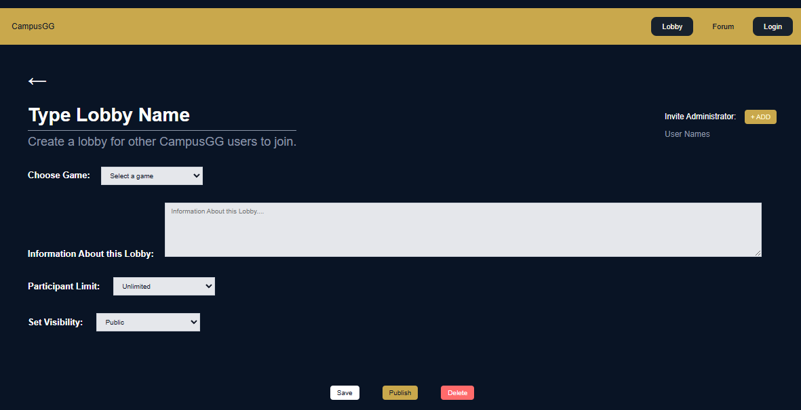
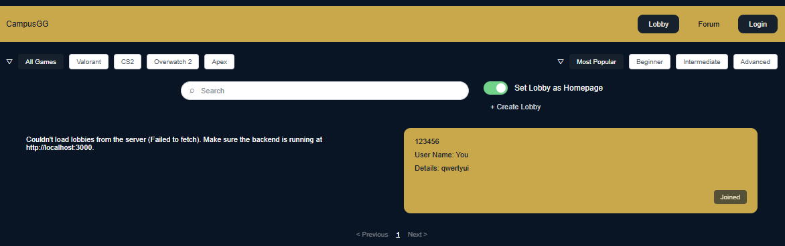

# Manual Test Report 003

**Test Case ID:** LOB-001

**Test Title:** Create Lobby with Required Lobby Information

**Related Requirement(s):** FR-014

**Tester Name:** Jingwen Huang

**Date Executed:** 2026-09-21

**Environment:** Localhost, Windows 11, Google Chrome, CampusGG `main` branch

## Preconditions

* The CampusGG frontend is running locally.

* The Lobby page is available in the browser.

* The user can access the Create Lobby form by selecting the `+ Create Lobby` button.

## Test Steps

| Step | Action                                                                                                                             | Expected Result                                                                                                     | Actual Result                                                                                                                                  | Pass/Fail |
| :--- | :--------------------------------------------------------------------------------------------------------------------------------- | :------------------------------------------------------------------------------------------------------------------ | :--------------------------------------------------------------------------------------------------------------------------------------------- | :-------- |
| 1    | Open the CampusGG Lobby page and select the `+ Create Lobby` button.                                                               | The Create Lobby form opens and provides fields for game, rank, maximum players, and description.                   | The Create Lobby form opened and provided fields for game, participant limit, and description. However, the form did not provide a rank field. | Fail      |
| 2    | Enter the lobby name, select Valorant as the game, select 20 as the participant limit, enter a description, and publish the lobby. | The lobby is created with the selected game, rank, maximum player count, and description.                           | The lobby was published successfully, but no rank could be selected or stored because the form did not include a rank field.                   | Fail      |
| 3    | Return to the Lobby page and inspect the newly created lobby card.                                                                 | The new lobby card displays the required lobby information, including game, rank, maximum players, and description. | The lobby card displayed the lobby name, username, and description. It did not display the rank or maximum player count.                       | Fail      |

## Overall Result

**FAIL**

## Evidence & Notes

* The Create Lobby form does not include a field that allows the user to select or enter a rank.

### Evidence 1: Create Lobby Form

The form includes game, participant limit, and description fields, but it does not include a rank field.

### Evidence 2: Published Lobby Card

The published lobby card does not display the lobby rank or maximum player count.

* The relevant frontend implementation can be found here: [CampusGG Create Lobby implementation](https://github.com/MAGG4444/CampusGG/blob/main/frontend/index.html)